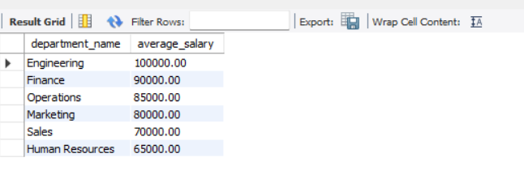
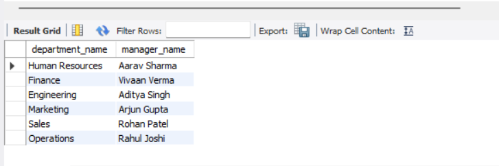
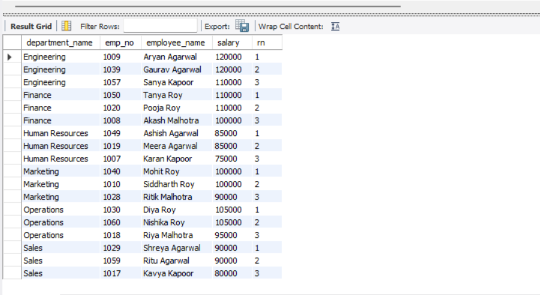

# Employee Management Database

A MySQL-based Employee Management Database designed to demonstrate relational database design, historical HR data modeling, and analytical SQL techniques.

This project simulates an HR management system by storing employee records, department assignments, salary history, job titles, and managerial information. It includes a normalized schema, realistic sample data, and a collection of analytical SQL queries commonly used in business reporting.

---

## Project Statistics

| Metric | Value |
|---------|------:|
| Database | MySQL |
| Tables | 6 |
| Employees | 60 |
| Departments | 6 |
| Analytical Queries | 25+ |
| Normalization | Third Normal Form (3NF) |

---

## Project Features

- Normalized relational database design (3NF)
- Historical employee salary tracking
- Employee department history
- Department manager history
- Employee title history
- Primary & Foreign Keys
- Composite Keys
- Constraints
- Indexing
- Analytical SQL queries

---

## Database Schema

The project consists of six relational tables.

| Table | Description |
|--------|-------------|
| employees | Stores employee demographic and employment details |
| departments | Stores department information |
| employee_departments | Tracks employee department history |
| department_managers | Stores department manager assignments |
| salaries | Stores employee salary history |
| employee_titles | Stores employee title history |

---

# Entity Relationship Diagram


---

# Technologies Used

- MySQL
- MySQL Workbench
- SQL

---

# SQL Concepts Demonstrated

### Database Design

- Third Normal Form (3NF)
- Relational Modeling
- Primary Keys
- Foreign Keys
- Composite Keys
- Constraints
- Indexing

### SQL

- SELECT
- WHERE
- ORDER BY
- GROUP BY
- HAVING
- Aggregate Functions
- INNER JOIN
- Subqueries
- Common Table Expressions (CTEs)
- Window Functions

---

# Project Structure

```
Employee-Management-Database/
│
├── schema.sql
├── sample_data.sql
├── employee_queries.sql
├── README.md
│
├── erd/
│   └── employee_management_erd.png
│
└── screenshots/
    ├── 01_average_salary_by_department.png
    ├── 02_current_department_managers.png
    ├── 03_top_3_earners_by_department.png
    ├── 04_executive_dashboard.png
    └── 05_salary_ranking.png
```

---

# How to Run

### 1. Create the database

Run:

```sql
schema.sql
```

### 2. Insert sample data

Run:

```sql
sample_data.sql
```

### 3. Execute analytical queries

Run:

```sql
employee_queries.sql
```

---

# Sample Query Results

## Average Salary by Department



---

## Current Department Managers



---

## Top 3 Earners by Department



---

## Executive Dashboard


---

## Salary Ranking


---

# Learning Outcomes

This project strengthened my understanding of:

- Relational Database Design
- Database Normalization
- SQL Query Optimization
- Business-Oriented SQL Analysis
- Window Functions
- Common Table Expressions
- HR Data Modeling

---

# Future Improvements

Potential enhancements include:

- SQL Views
- Stored Procedures
- Triggers
- User Roles & Permissions
- Power BI Dashboard Integration

---

# Author

**Nishika Roy**

GitHub: https://github.com/Royxnish
